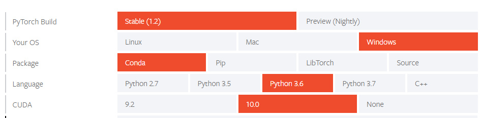

# PyTorchCV Studio

PyTorchCV Studio is a graphical annotation tool to address different Computer Vision tasks. 

PyTorchCV is developed in Python, Qt, SQLite and uses PyTorch's resources to train deep learning models.

</img> 

PyTorch CV Studio supports:

**Datasets**:
* Create and manage your datasets for images.
* Manually annotate images:
    * Using a label system for classification problems.
    * Using a bounding box for localization and object detection problems.
    * Using a polygon tool or freehand selection for segmentation tasks.
* Auto-annotate images with a pretrained model to continue tagging the images by your own.

[Watch a demo video](https://www.youtube.com/watch?v=nA8uMonPXk4&t=27s)

## Roadmap

* **Datasets:** Annotations for videos.
* **Models:** 
    * Build your own custom models using a pretrained model from PyTorch Hub and your annotated dataset.
    * Publish your own custom models to PyTorch Hub.
* **Experiments:** Develop experiments using your datasets and models from PyTorch Hub or your custom  trained models.
* **Platforms:**  macOS and Linux support.

## Installation

> **Note:** PyTorch CV Studio only have been developed and tested on Windows. Future platforms (macOS and Linux) 
>are in the roadmap.

**Windows + Anaconda:**

* Clone the repository:
  > `git clone https://github.com/haruiz/PytorchCvStudio.git`
* Download and install [Anaconda](https://www.anaconda.com/distribution/#download) (Python 3+).
* Open Anaconda Prompt, go to *PyTorchCV* directory and follow the next steps:
  * Create a new environment with Python 3.6:  
    > `conda create --name pytorchcv python=3.6`
  * Install required libraries:
    > `pip install -r pip_req.txt`
  * Install [PyTorch](https://pytorch.org/) with conda following the [instructions](https://pytorch.org/get-started/locally/)
    in the official site. For the purpose of this tutorial we are selecting the following configuration:
    
    </img>
    
    > `conda install pytorch torchvision cudatoolkit=10.0 -c pytorch`
* Run and enjoy PyTorchCV Studio: 
  > `python pytorchcv.py`

## How to contribute

Send a pull request.
 
## License

[Free software: MIT license](https://github.com/haruiz/PytorchCvStudio/blob/master/LICENSE)

Citation: haruiz. PyTorchCV Studio. Git code (2019). https://github.com/haruiz/PytorchCvStudio

## Credits

* 
Icons made by <a href="https://www.flaticon.com/authors/dave-gandy" title="Dave Gandy">Dave Gandy</a> from <a href="https://www.flaticon.com/" title="Flaticon">www.flaticon.com</a>

* 
Icons made by <a href="https://www.flaticon.com/authors/pixelmeetup" title="Pixelmeetup">Pixelmeetup</a> from <a href="https://www.flaticon.com/" title="Flaticon">www.flaticon.com</a>

* 
Icons made by <a href="https://www.flaticon.com/authors/smashicons" title="Smashicons">Smashicons</a> from <a href="https://www.flaticon.com/" title="Flaticon">www.flaticon.com</a>

* 
Icons made by <a href="https://www.flaticon.com/authors/eucalyp" title="Eucalyp">Eucalyp</a> from <a href="https://www.flaticon.com/" title="Flaticon">www.flaticon.com</a>

* 
Icons made by <a href="https://www.flaticon.com/authors/becris" title="Becris">Becris</a> from <a href="https://www.flaticon.com/" title="Flaticon">www.flaticon.com</a>

* 
Icons made by <a href="https://www.flaticon.com/authors/smashicons" title="Smashicons">Smashicons</a> from <a href="https://www.flaticon.com/" title="Flaticon">www.flaticon.com</a>

* 
Icons made by <a href="https://www.flaticon.com/authors/freepik" title="Freepik">Freepik</a> from <a href="https://www.flaticon.com/" title="Flaticon">www.flaticon.com</a>

* 
Icons made by <a href="https://www.flaticon.com/authors/those-icons" title="Those Icons">Those Icons</a> from <a href="https://www.flaticon.com/" title="Flaticon">www.flaticon.com</a>
