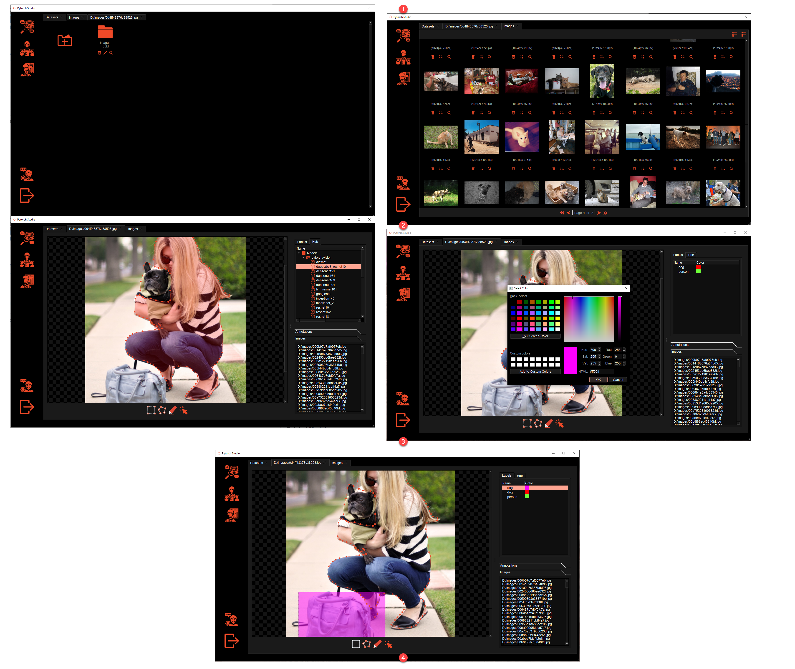

# CV-Studio

</img>
 
CV-Studio is a graphical annotation tool to address different Computer Vision tasks. 

CV-Studio is developed in Python, Qt, SQLite and uses PyTorch's resources to train deep learning models.

 

CVStudio supports:

**Datasets**:
* Create and manage your datasets for images.
* Manually annotate images:
    * Using a label system for classification problems.
    * Using a bounding box for localization and object detection problems.
    * Using a polygon tool or freehand selection for segmentation tasks.
* Auto-annotate images with a pretrained model to continue tagging the images by your own.

[Watch a demo video](https://www.youtube.com/watch?v=xtNhWr083lM)

## Roadmap

* **Datasets:** Annotations for videos.
* **Models:** 
    * Build your own custom models using a pretrained model from PyTorch Hub and your annotated dataset.
    * Publish your own custom models to PyTorch Hub.
* **Experiments:** Develop experiments using your datasets and models from PyTorch Hub or your custom  trained models.
* **Platforms:**  macOS and Linux support.

## Installation

> **Note:** CV-Studio only have been developed and tested on Windows. Future platforms (macOS and Linux) 
>are in the roadmap.

### 1. Installing dependencies

**Windows + Anaconda:**

* Clone the repository:
  
  ```console
    git clone https://github.com/haruiz/CvStudio.git
  ```
* Download and install [Anaconda](https://www.anaconda.com/distribution/#download) (Python 3+).
* Open Anaconda Prompt, go to *CvStudio* directory and follow the next steps:
  * Create a new environment with Python 3.6:
  
  ```console  
    conda create --name cvstudio python=3.6
  ```
  * Install required libraries:
  
  ```console
    pip install matplotlib
    pip install numpy
    pip install opencv-contrib-python
    pip install pillow
    pip install tqdm
    pip install scipy
    pip install "dask[complete]"
    pip install more-itertools
    pip install pandas
    pip install PyQt5
    pip install apptools -U
    pip install imutils
    pip install peewee
    pip install -U marshmallow
    pip install hurry.filesize
    pip install Mako    
    ```
    
  * Install [PyTorch](https://pytorch.org/) with conda following the [instructions](https://pytorch.org/get-started/locally/)
    in the official site. For the purpose of this tutorial we are selecting the following configuration:
    
    - Using GPU:<br>
    ```console
        conda install pytorch torchvision cudatoolkit=10.0 -c pytorch-nightly        
    ```
    - Using CPU:<br>
    ```console
        conda install pytorch torchvision cpuonly -c pytorch-nightly -c defaults -c conda-forge        
    ```

### 2. Download models
This command must be executed from the CVStudio folder:
**Windows (PowerShell)**
 ```console
    Invoke-WebRequest -OutFile ./models/MS_DeepLab_resnet_trained_VOC.pth https://data.vision.ee.ethz.ch/csergi/share/DEXTR/MS_DeepLab_resnet_trained_VOC.pth
    Invoke-WebRequest -OutFile ./models/dextr_pascal-sbd.pth https://data.vision.ee.ethz.ch/csergi/share/DEXTR/dextr_pascal-sbd.pth
```

**Linux**

```console
    wget https://data.vision.ee.ethz.ch/csergi/share/DEXTR/MS_DeepLab_resnet_trained_VOC.pth -P ./models
    wget https://data.vision.ee.ethz.ch/csergi/share/DEXTR/dextr_pascal-sbd.pth -P ./models
```

### 3. Run CVStudio
```console
    python cvstudio.py
```


## Documentation

Check out the [wiki](https://github.com/haruiz/CvStudio/wiki).

## How to contribute

Send a pull request.
 
## License

[Free software: MIT license](https://github.com/haruiz/CvStudio.git/blob/master/LICENSE)

Citation: haruiz. CV-Studio. Git code (2019). https://github.com/haruiz/CvStudio

## Credits

### Images and Icons
* <div>Icons made by <a href="https://www.flaticon.com/authors/dave-gandy" title="Dave Gandy">Dave Gandy</a> from <a href="https://www.flaticon.com/" title="Flaticon">www.flaticon.com</a></div>
* <div>Icons made by <a href="https://www.flaticon.com/authors/pixelmeetup" title="Pixelmeetup">Pixelmeetup</a> from <a href="https://www.flaticon.com/" title="Flaticon">www.flaticon.com</a></div>
* <div>Icons made by <a href="https://www.flaticon.com/authors/smashicons" title="Smashicons">Smashicons</a> from <a href="https://www.flaticon.com/" title="Flaticon">www.flaticon.com</a></div>
* <div>Icons made by <a href="https://www.flaticon.com/authors/eucalyp" title="Eucalyp">Eucalyp</a> from <a href="https://www.flaticon.com/" title="Flaticon">www.flaticon.com</a></div>
* <div>Icons made by <a href="https://www.flaticon.com/authors/becris" title="Becris">Becris</a> from <a href="https://www.flaticon.com/" title="Flaticon">www.flaticon.com</a></div>
* <div>Icons made by <a href="https://www.flaticon.com/authors/smashicons" title="Smashicons">Smashicons</a> from <a href="https://www.flaticon.com/" title="Flaticon">www.flaticon.com</a></div>
* <div>Icons made by <a href="https://www.flaticon.com/authors/freepik" title="Freepik">Freepik</a> from <a href="https://www.flaticon.com/" title="Flaticon">www.flaticon.com</a></div>
* <div>Icons made by <a href="https://www.flaticon.com/authors/those-icons" title="Those Icons">Those Icons</a> from <a href="https://www.flaticon.com/" title="Flaticon">www.flaticon.com</a></div>

### Models 

[Deep Extreme Cut: From Extreme Points to Object Segmentation](https://github.com/scaelles/DEXTR-PyTorch/)
</img> 